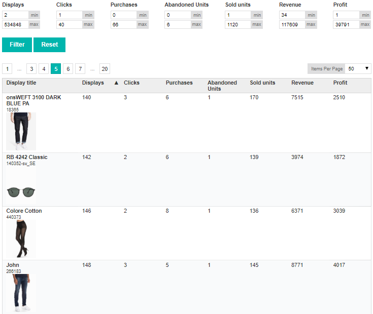

# Product report

Отчет по продуктам в табличном представлении.

Данные для отчета по продуктам расположены в файле product-data.json, который содержит массив из объектов с параметрами и метриками продукта.

В таблице имеется возможность сортировки по выбранной колонке и фильтрации данных на клиентской стороне. Сортируемыми и фильтруемыми колонками являются все числовые параметры отчета.

Сортировка данных в таблице применяется при клике на ячейку с наименованием колонки. Активная выбранная колонка должна быть отмечена соответствующей порядку сортировки иконкой. Выбор порядка сортировки осуществляется следующим образом: первый клик - по убыванию, второй клик - по возрастанию, третий клик - сброс сортировки.

Фильтрация представлена в виде списка наименований колонок с полями для минимального и максимального значений диапазона, расположенным над таблицей отчета. Для того чтобы пользователь имел представление о диапазоне возможных значений для каждого из параметров отчетов, необходимо вычислить и отобразить граничные значения в соответствующих полях формы фильтров.

Валидация введенных пользователем значений реализована с использованием автокоррекции значений при потере фокуса соответствующим полем фильтра в случае, если введенное значение не является корректным.

Реализована пагинация с выбором количества отображаемых на странице элементов.

В данной задаче используется только JavaScript без дополнительных вспомогательных библиотек. Для стилизации отчета используется CSS.